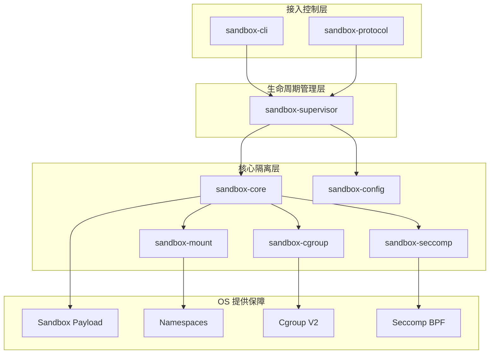
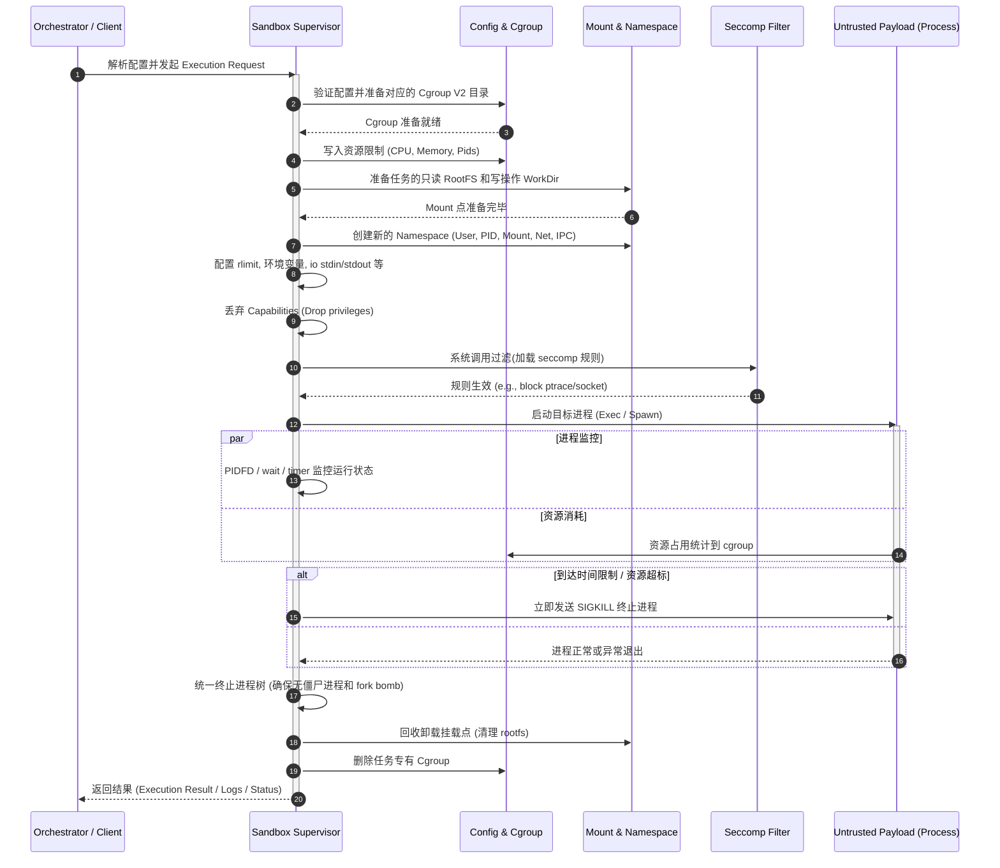

# Sandbox Architecture and Runtime Sequence

## 1. 架构设计图 (Architecture Diagram)

架构图展示了整个沙箱项目各组件的分层关系，从外部请求接入层一直到最底层的系统资源隔离层。

## 2. 运行时序图 (Runtime Sequence Diagram)

时序图详细描述了一次不可信代码执行的完整生命周期，对应于设计文档中的“生命周期设计”。

